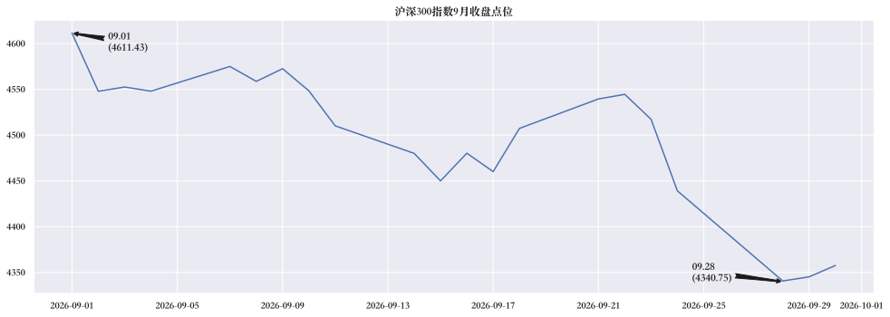
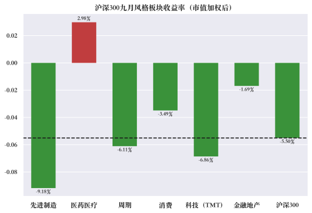
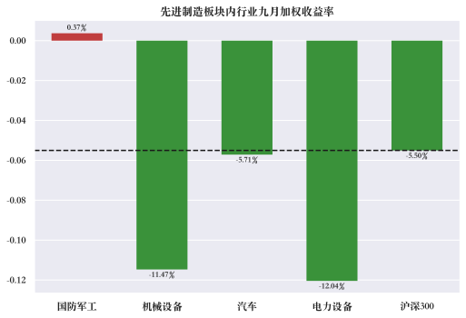
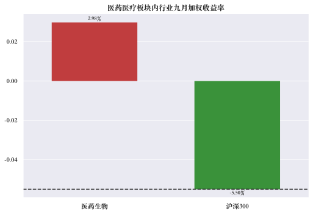
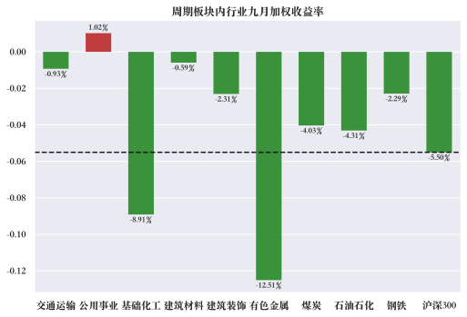
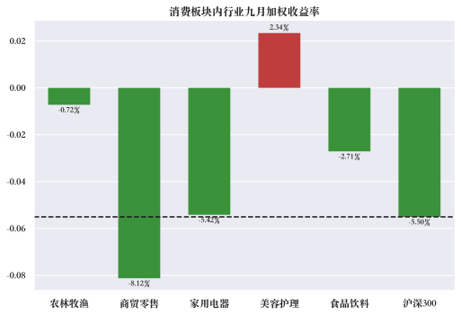
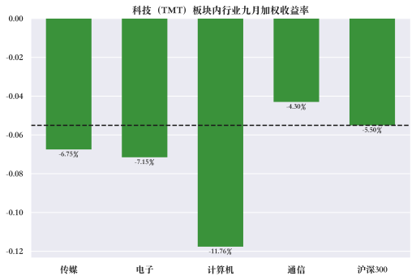
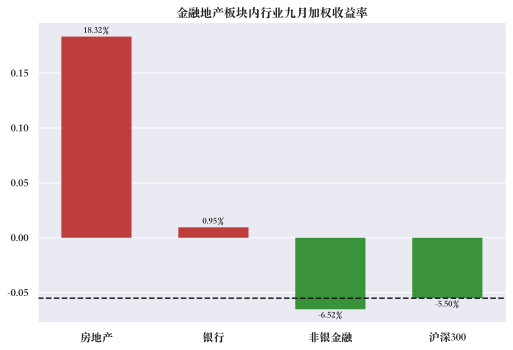
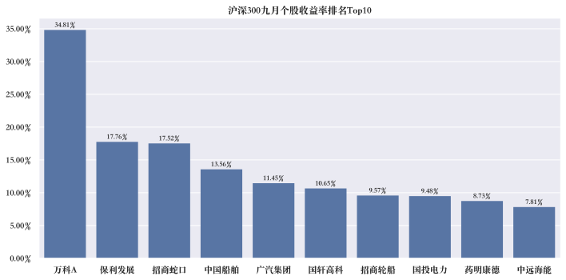
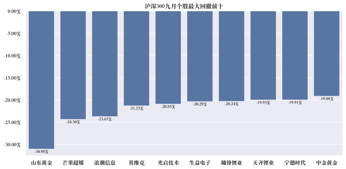

# 沪深300九月市场回顾

*研究区间：2026年9月1日 – 2026年9月30日本报告所有收益率与回撤计算，均基于个股每日前复权收盘价和指数每日收盘点位。*

*本报告数据来源于 baostock 证券宝数据库与 akshare 开源金融数据接口库。其中，akshare 相关行情与行业数据通过其东方财富数据源接口获取。*

## 一、沪深300整体市场表现

**1.区间整体概况**

沪深300九月走势

- 九月最高点位：9月1日（4611.43点）
- 九月最低点位：9月28日（4340.75点）
- 九月区间总收益率：-5.5%
- 九月区间最大回撤：5.87%

**整体概况总结：**
沪深 300 在 9 月以 4611.43 的高点开盘，月初震荡下行，中旬出现一轮弱势反弹，但反弹无力未能扭转趋势；随后指数再度走弱持续下行，在 9 月 28 日触及全月低点 4340.75，月末在低位小幅企稳。

**2.重点事件背景：**

- **9 月初**，美国通胀与就业数据表现偏强，市场重新定价美联储加息预期。海外流动性收紧预期压制全球权益资产，北向资金风险偏好回落，对沪深 300 等大盘权重板块形成压力。
- **9 月中旬**，8 月宏观经济数据发布，内需修复力度低于市场预期，指数下探阶段低点；随后博弈稳增长预期出现一轮弱势反弹，但反弹缺乏增量资金，很快遇阻回落，进入主跌阶段。
- **9月29日**：
    - **财政部 + 央行 + 金融监管总局**：首套住房贷款贴息政策（10 月 1 日起实施，年化贴息 1%，暂定 1 年），托底地产链条；
    - 央行同步：下调 PSL 利率、增加科创再贷款、支农支小再贷款额度，结构性宽松加码；
    - 指数出现小幅企稳回升。

## 二、风格板块聚类分析

**1.板块分类（申万大类风格板块）：**

- **周期**：石油石化、煤炭、有色金属、钢铁、基础化工、建筑材料、建筑装饰、交通运输、公共事业、环保
- **先进制造**：电力设备、机械设备、国防军工、汽车
- **科技（TMT）**：电子、计算机、通信、传媒
- **消费**：农林牧渔、食品饮料、家用电器、防止服饰、轻工制造、商贸零售、社会服务、美容护理
- **医药医疗**：医药生物
- **金融地产**：银行

**2.六大板块加权9月收益率（对比沪深300收益率）**

**计算方法：板块加权收益率 =（板块个股收益率个股权重）总和 / 板块个股权重总和
该计算方法等价于”假设从9月1日起满仓该风格板块，按沪深300内个股权重配比，持有至9月底的收益率”*

六大板块加权收益率

- **唯一上涨**：医药医疗是六大风格中唯一收红的板块，收益率 +2.98%，超额收益显著。
- **相对抗跌**：金融地产（-1.69%）和消费（-3.49%）跌幅小于沪深300，体现出防御属性。
- **主要拖累**：先进制造（-9.18%）跌幅最大，科技TMT（-6.86%）和周期（-6.11%）也明显跑输基准。
- **整体分化**：9月沪深300风格分化剧烈，防御与政策受益方向占优，先进制造和科技成长承压。

**3.各大板块内行业收益分析**

- 9月沪深300内只有 **6个行业** 录得正收益。
- **金融地产** 占了两席，其中房地产 +18.32% 最突出。
- **医药医疗、消费、公用事业** 属于防御/稳健方向，正收益符合避险特征。
- **科技（TMT）** 没有一个行业为正，是9月最弱的大类。
- **先进制造** 里只有国防军工微涨 +0.37%，其余（机械、汽车、电力设备）都大幅下跌。
- **美容护理 +2.34%**，是消费板块唯一红盘。

**4.政策、事件驱动**

- **国务院常务会议：研究出台稳定房地产市场政策措施**
9月28日，李强总理主持召开国务院常务会议，明确提出”研究出台稳定房地产市场、促进就业增收等政策措施”，同时要求”加大宏观政策逆周期调节力度”“推出一批务实管用的增量政策”。
- **居民购房贷款贴息政策（中央财政首次）**
9月29日，财政部、中国人民银行、金融监管总局联合发文，明确自2026年10月1日起实施居民购房贷款贴息政策，政策实施期暂定1年。对符合条件的首套住房商业性个人住房贷款，财政部门按贷款本金给予年化1个百分点、期限不超过5年的贴息支持，单户可享受贴息的贷款规模上限为100万元，最多可帮助借款人累计减少付息近5万元。
- **央行结构性货币政策工具”四箭齐发”**
9月29日，中国人民银行通过下调抵押补充贷款利率、扩大其支持领域、增加科技创新和技术改造再贷款额度、增加支农支小再贷款额度等方式，持续调整完善货币政策工具以支持经济。
- **2026年国家医保药品目录谈判竞价启动**
9月5日至8日，2026年国家医保药品目录现场谈判竞价在全国人大会议中心举行。124个目录外药品入围谈判竞价环节，部分肿瘤、罕见病、慢性病以及儿童用药等重点领域创新药参与谈判，有望纳入医保目录。商业健康保险创新药品目录调整工作同步开展，12个药品入围现场价格协商。
- **工信部等十部门联合印发《医药工业发展”十五五”规划》**
9月18日，工信部等十部门联合印发该规划，明确到2030年规模以上医药工业企业营业收入超过3.5万亿元，创新药产业规模年均增速达到20%以上。这是中国医药产业首次在国家级规划中将创新药增长速率量化为明确指标。
- **医药出海体系化推进**
国家医保局布局的宁波中东欧医药交易（集采）平台正式上线运行，覆盖东南亚、中亚、中东欧等地区的国家级医药出海网络基本成型，中国医药出海进入政府搭台、体系化推进的新阶段。
- **化妆品零售数据回暖**
上半年化妆品类零售额2445亿元，同比增长6.3%，中高端美妆回暖明显，“基础+功效型”护肤仍是主流，植物提取物新原料备案占比达42.2%。

## 三、沪深300成分个股分析

**1.沪深300成份个股九月区间收益率**

- **房企龙头集体爆发**
    
    万科A（+34.81%）：板块情绪龙头。除政策贝塔外，还有王石回归城市更新、债务化解预期等个股催化。9月30日开盘一度跌停，随后被资金拉起，走出”地天板”式极端反转，多空博弈激烈。
    
    保利发展（+17.76%）：财务稳健的央企龙头，受益于”核心城市+优质房企”逻辑，属于政策驱动下的估值修复。
    
    招商蛇口（+17.52%）：同样受益于政策利好和优质房企重估，跟涨但弹性略低于万科A。
    
- **中国船舶（+13.56%）：订单饱满，造船大周期兑现**
    
    驱动类型：基本面驱动
    
    核心催化剂：
    
    - 9月2日公告签订10艘LNG双燃料动力汽车运输船新造船合同，总金额逾10亿美元。
    - 2026年上半年归母净利润99.54亿元，同比增长163.51%；手持订单达5262.66亿元，排期饱满。
    - 全球造船市场“量价共振、订单升级、交付提速”，2026年交付订单中高价订单占比跃升至73%，船企毛利率持续修复。
    
- **广汽集团（+11.45%）：重磅重组预案，复牌一字涨停**
    
    驱动类型：事件驱动
    
    核心催化剂：
    
    - 9月28日晚披露重大资产重组预案，拟发行股份收购中国一汽持有的一汽丰田50%股权。
    - 9月29日复牌后开盘直接封死一字涨停，封单高达95万手以上。
    - 重组完成后将同时持有广汽丰田、一汽丰田，实现“南北丰田”统筹协调，规模协同效应显著。

- **国轩高科（+10.65%）：绑定大众，出海战略落地**
    
    驱动类型：事件驱动
    
    核心催化剂：
    
    - 9月28日晚公告，拟与大众汽车集团在西班牙、斯洛伐克、摩洛哥组建三家合资公司，投建锂电池和正极材料生产基地，预计总投资约32.22亿欧元（约合人民币246亿元）。
    - 9月29日开盘约8分钟即封住涨停，封单超过89万手。
    - 深度绑定全球第二大车企大众，被视为全球化战略落地的关键里程碑。

- **招商轮船（+9.57%）：油运超级周期共振**
    
    驱动类型：行业景气驱动
    
    核心催化剂：
    
    - 受中东地缘局势紧张、霍尔木兹海峡干扰可能较预期持久等因素影响，超大型油轮（VLCC）有效运力大幅收紧。
    - 三年期VLCC期租船合约每日租金一度达10万美元高位，油轮市场景气度和持续性有望继续超越市场预期。
    - 9月17日招商轮船直线拉涨停，年内涨幅一度超过136.75%。

- **国投电力（+9.48%）：股东增持+行业政策护航**
    
    驱动类型：资金+政策驱动
    
    核心催化剂：
    
    - 2026年7月20日至9月11日，控股股东国投集团以自有资金累计增持551.72万股，增持金额约8017万元，且增持计划尚未实施完毕。
    - “十五五”规划密集落地、容量电价机制持续完善，为电力行业提供长期制度性支撑。
    - 光伏发电装机历史性超过煤电，电力板块整体走强，国投电力作为权重股受益。

- **药明康德（+8.73%）：业绩超预期+创新药政策共振**
    
    驱动类型：基本面+政策驱动
    
    核心催化剂：
    
    - 公司交出近年来最亮眼的半年报后，全面上调2026年业绩指引，股价一路走高。
    - 高盛研报指出，亚洲CDMO需求可见性提升，行业焦点已从复苏趋势转向下一轮增长周期的持久性，看好药明康德对全球GLP-1商业化放量及TIDES需求的高杠杆受益。
    - 《医药工业发展“十五五”规划》首次量化创新药指标，明确提出创新药产业规模年均增速达到20%以上，药明康德作为CXO龙头直接受益。

- 中远海能（+7.81%）：油运运价急升，大摩重申增持
    
    **驱动类型**：行业景气驱动
    
    **核心催化剂**：
    
    - 与招商轮船共享油运超级周期逻辑，VLCC运价暴涨，有效运力收紧。
    - 摩根士丹利重申中远海能“增持”评级，认为9月大部分急升的运价会反映在第四季业绩，支撑油轮航运持续牛市。
    - 9月17日跟随招商轮船大涨，中远海能跟涨超过6%。
    

**2.沪深300成份个股九月最大回撤**

9月最大回撤前十呈现出清晰的”前期热门赛道集体退潮”特征：

**黄金板块：美联储鹰派信号与美债收益率飙升，金价集体跳水。**

- **山东黄金（-30.98%）** ：跌幅远超板块，核心是个股基本面暴雷。9月24日公司公告将2026年黄金产量计划由原”不低于49吨”大幅下调至36吨—38吨，预计同比减少约11—13吨，并明确预计2026年净利润同比下降。9月28日山东黄金跌停。
- **中金黄金（-19.08%）** ：无个股层面利空，跌幅与板块整体一致，主要受金价宏观压制和板块情绪拖累。公司套保策略为冶炼厂对冲原料价格风险，三季度业绩受金价高位回调影响。

**锂电产业链：碳酸锂价格崩跌。**

- 9月以来碳酸锂市场呈单边下行走势，9月28日碳酸锂期货主力合约收跌5.69%，价格刷新年内低点。瑞银进一步下调国内锂价预测，美银证券指出锂价回调反映多重忧虑，市场对远期需求的预期偏悲观。
- **宁德时代（-19.91%）** ：除行业因素外，还面临三大个股利空：①车企”去宁化”加速——理想、小米、小鹏、蔚来等多家车企采用自研或多供应商策略，降低对宁德时代的依赖；②消费税加征——9月1日起锂离子蓄电池按2%税率征收消费税，2027年9月将升至4%；③理想汽车拟以26.5亿元入股欣旺达动力，进一步加剧市场担忧。股价自9月加速下行，一度失守300元关口，相较5月高点回调超35%，市值蒸发超7000亿元。
- **赣锋锂业、天齐锂业**：主要跟随碳酸锂价格下跌，无额外重大个股利空。摩根大通指出，随着江西锂云母减产及津巴布韦出口管制等利好催化剂已基本释放，未来风险偏向不利消息。

**AI硬件板块遭遇资金切换。**
9月4日，OpenAI发布GPT-6 Astra后，A股AI硬件板块集体重挫。浪潮信息封死跌停，单日市值蒸发约127亿元；紫光股份大跌7.50%，锐捷网络下跌6.33%，三家千亿级硬件公司单日合计蒸发市值超290亿元。市场关于”资金从算力硬件切向AI应用”的讨论迅速升温。

- **浪潮信息（-23.65%）** ：作为AI服务器龙头，是板块资金切换的最大受害者。9月4日一字跌停，机构专用席位净卖出7.74亿元。市场传言Q3业绩环比走弱，以及海外大模型厂商服务器宕机事件被解读为对公司业务的负面冲击，公司回应称”难以确定股价下跌的具体原因”。
- **英维克（-21.23%）** ：液冷龙头，问题出在业绩与股价的严重背离。上半年归母净利同比下滑14.32%，一季度净利润仅865.76万元，同比下降81.97%，财务费用同比增长77倍，应收账款坏账和存货跌价准备计提增加。公司去年股价涨幅高达246%，市场预期极高，但业绩持续”增收不增利”，导致股价持续回调。外资投行对同一份财报给出截然不同的评级，目标价从49元到125元差距超过一倍。
- **生益电子（-20.29%）** ：9月28日光模块板块全线重挫，中际旭创跌超9%，生益电子跌逾7%。下跌受三方面因素共振扰动：①美国议员提出新法案拟禁止中国光收发器进入美国国家安全系统；②中东地缘扰动，市场风险偏好收缩；③美债收益率攀升，外资流出隐忧压制成长板块。此外，控股股东因可交换公司债券换股导致持股比例被动稀释，以及公司抛出22.57亿元大额扩产计划引发资金链担忧，也构成短期压力。

**芒果超媒（-24.30%）：业绩断崖式下滑**

- 2Q26净利润同比99% 至约200万元，剔除其他经营收支的核心经营利润转亏约1亿元；1H26会员订阅收入同比23%，上半年净利润同比大降73.58%。
- 高盛维持卖出评级，12个月目标价由15.5元下调至13.3元，认为会员收入承压而成本刚性持续，经营去杠杆挤压利润。
- AI长剧曾短暂拉动股价，但业绩公布后迅速回调，属于典型的”概念炒作退潮+基本面兑现利空”。

**光启技术（-20.85%）：交付递延+股东质押担忧**

- 上半年营收增长约20%，但净利润同比下降约17%，利润波动主因：部分客户调整生产节奏导致交付递延；客户结构变化及会计政策影响，信用减值高于往年；研发和生产投入持续增加。
- 控股股东西藏映邦因税款补缴（缴税比例由15%调整为25%）产生一次性资金需求，通过补充质押方式融资，引发市场对股东质押风险的担忧。公司回应称大股东质押比例较低，不存在被平仓风险。
- 募投项目调整（709基地延期半年、研发中心投资增加3.42亿元）也引发了市场对公司产能释放节奏的疑虑。

## 四、研究总结与局限性

**1.行情复盘总结：**

9月沪深300走出一段完整的三段式下行行情，核心驱动来自”外部流动性收紧 → 内需修复低于预期 → 政策底预期托底”的逐层演绎：

- **第一段（9月初 – 中旬，高位回落）**：美国通胀与就业数据偏强，市场重新定价美联储加息预期，海外流动性收紧预期压制全球权益资产，北向资金风险偏好回落，指数自 4611.43 高点震荡下行，大盘权重板块首当其冲。
- **第二段（9月中旬 – 下旬，弱反弹后主跌）**：8月宏观经济数据发布，内需修复力度低于市场预期，指数下探阶段低点；随后博弈稳增长预期出现一轮弱势反弹，但缺乏增量资金承接，反弹遇阻后进入主跌段，9月28日触及全月低点 4340.75。
- **第三段（9月29日 – 月末，低位企稳）**：9月28日国常会研究稳定房地产市场政策，9月29日地产贴息+央行结构性工具”四箭齐发”，政策底预期升温，指数在低位小幅企稳回升。

**核心矛盾**：全月指数跌幅 -5.5%、最大回撤 5.87%，本质上是一轮”分子端盈利预期下修 + 分母端海外流动性收紧”的共振调整，政策仅在月末提供了一个情绪托底的边际变量，尚未形成趋势反转。

**2.板块特征总结：**

9月沪深300风格分化剧烈，**防御与政策受益方向占优，成长与周期承压**，资金明显流向确定性：

- **唯一赢家是防御+政策双主线**：医药医疗（+2.98%）是六大风格中唯一收红的板块，兼具避险属性与医保谈判、创新药”十五五”规划等政策催化；金融地产（-1.69%）凭地产政策预期相对抗跌。
- **资金偏好从”高景气成长”切向”低估值确定性”**：先进制造（-9.18%）、科技TMT（-6.86%）、周期（-6.11%）三大成长/周期方向集体跑输，反映在海外流动性收紧、风险偏好回落的环境下，市场对高估值成长赛道的容忍度显著下降。
- **行业内部分化同样剧烈**：9月仅有 6个行业录得正收益，金融地产占两席（房地产 +18.32%），科技TMT 无一行业为正；先进制造中仅国防军工微涨 +0.37%。
- **轮动节奏特征**：月内呈现出”高位股集体退潮”的存量博弈特征，前期涨幅居前的黄金、锂电、AI硬件成为资金撤离的重灾区，资金向低位、政策直接受益方向做防御性再配置。

**3.个股层面总结：**

**（1）领涨个股共性**

- **政策驱动是第一主线**：涨幅居前的房企龙头（万科A +34.81%、保利发展 +17.76%、招商蛇口 +17.52%）几乎全部来自地产链，直接受益于国常会稳地产表态与居民购房贴息政策。
- **事件/重组催化弹性最大**：广汽集团（+11.45%）因重磅重组预案复牌一字涨停，国轩高科（+10.65%）因绑定大众、出海落地，均体现出”事件驱动>基本面驱动”的短期弹性。
- **基本面+行业景气提供支撑**：中国船舶（+13.56%）订单饱满兑现造船大周期，药明康德（+8.73%）业绩超预期叠加创新药政策共振，属于”业绩+政策”双轮驱动。
- **共性提炼**：9月领涨个股集中在**低位、低估值、有明确政策或事件催化**的方向，市场给予”确定性溢价”，纯题材、高涨幅个股反而遭抛售。

**（2）市场结构性机会特征**

- **机会在”政策直接受益 + 防御”**：地产链、医药、公用事业、红利类方向是弱市中的相对避风港，可作为防御底仓。
- **风险集中在”前期热门赛道”**：黄金（山东黄金 -30.98%）、锂电（宁德时代 -19.91%）、AI硬件（浪潮信息 -23.65%）三大前期强势赛道的集体退潮，说明在流动性收紧、风险偏好下行阶段，**拥挤度过高的方向回撤风险最大**。
- **个股基本面雷点需重点规避**：以山东黄金（产量计划大幅下调）、英维克（业绩与股价严重背离）、芒果超媒（业绩断崖式下滑）为代表，弱市中”戴维斯双杀”的杀伤力极大，需警惕业绩与估值不匹配的标的。

**4.研究局限性**

- **样本与周期局限**：仅覆盖单月、且仅限沪深300成分股，样本区间短、代表性有限，结论不宜线性外推到其他月份或全市场。
- **前瞻性信息缺失**：本报告为事后复盘，未包含对10月起（尤其是地产贴息政策落地效果、央行结构性工具传导）的前瞻判断，政策效果尚待数据验证。
- **不构成投资建议**：本报告为市场回顾与研究性分析，所有内容不构成任何投资建议，据此操作风险自负。

---